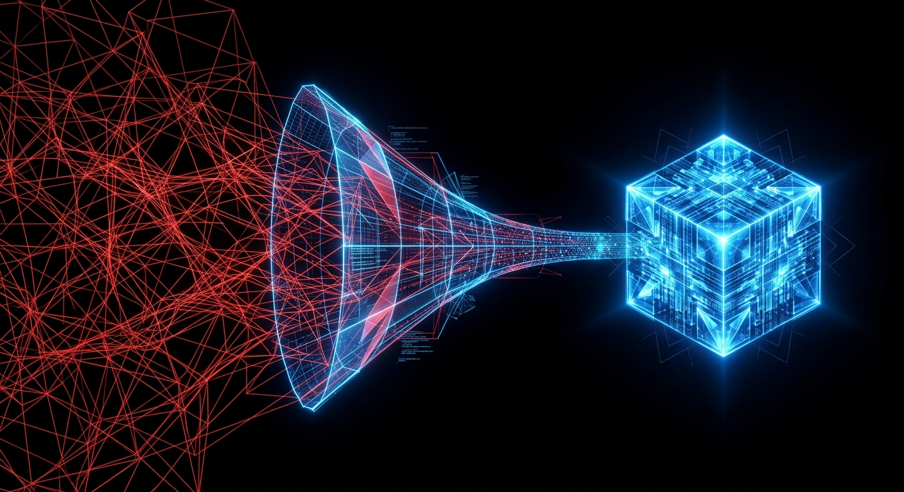
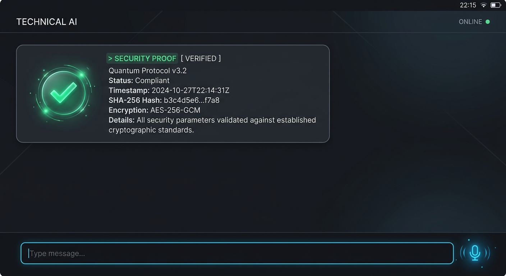

# 7 — RATISS CYPHER ODV — ARCHITECTURE D'INTÉGRATION LLM (THÉORIE PURE)
**DOCUMENT DE RÉFÉRENCE SYSTÈME — SECTEUR 7**
**CLASSIFICATION : PROPRIÉTÉ INTELLECTUELLE JOHNKING0 — NE PAS DUMPER LE CODE NATIF**

---

## 1. ARCHITECTURE GLOBALE DU FLUX COGNITIF

L'intégration de RATISS ne se fait pas *dans* le LLM, mais *autour* de lui. Le LLM est traité comme une unité de calcul statistique brute (une "fonderie de tokens"), tandis que RATISS agit comme le cortex préfrontal et le système de vérification formelle.

### Schéma Fonctionnel du Flux :


```text
[USER] 
  │
  ▼
[REACT CLEAN UI] ──────────────┐ (Demande de session sécurisée)
  │                            │
  ▼                            ▼
[NODE.JS ORCHESTRATOR] <──> [RATISS SIDECAR BRAIN] (Cœur Chiffré)
  │                            │ 
  │                            ├─ (1) TopologyCompressor (Pré-LLM)
  │                            └─ (2) Red-Team P vs NP (Contrainte)
  ▼                            
[LLM API (Llama/Mistral)]      
  │                            
  ▼                            
[TOPOZK VERIFIER (CPU)] <────── (3) Preuve de non-hallucination
  │
  ▼
[RESPONSE VALIDÉE] ──> [USER]
```

**Pourquoi le cerveau est Sidecar ?**
Modifier les poids d'un LLM (Fine-tuning) est une erreur de débutant pour un système souverain : cela dilue la logique dans les probabilités. En isolant RATISS dans un Sidecar (middleware), on garde le contrôle total sur la structure logique (P vs NP) sans subir l'entropie statistique du modèle de langage.

---

## 2. LE PATTERN "SIDECAR BRAIN" (THÉORIE COGNITIVE)

Le Sidecar Brain fonctionne sur trois piliers d'interception :

### A. Compression Topologique (Pré-Inférence)



Avant que le prompt n'atteigne le LLM, le **TopologyCompressor** réduit la dimensionnalité de la requête. Il ne s'agit pas d'un résumé de texte, mais d'une transformation de l'intention utilisateur en un graphe de contraintes minimales. Le LLM reçoit une structure "orientée" qui réduit drastiquement son champ d'exploration combinatoire (et donc son risque d'erreur).

### B. Garde-fou Synchrone (Contrainte en Temps Réel)
Le système injecte des preuves ZK CPU (Zero-Knowledge) pour verrouiller les chemins de réflexion. Si le LLM tente de s'évader dans une branche de calcul exponentielle (hallucination ou boucle infinie), la contrainte topologique casse le flux avant que le premier token erroné ne soit généré.

### C. Vérification Post-hoc (TopoZK)
Une fois le flux de tokens reçu, le **TopoZK Verifier** reconstruit la trace logique sur CPU. Si la réponse ne peut pas être prouvée cryptographiquement comme étant dérivée du graphe de contraintes initial, elle est rejetée instantanément, même si elle semble "humaine" ou "crédible".

---

## 3. EXEMPLE D'INTÉGRATION GÉNÉRIQUE (NODE.JS & REACT)

### Backend (Node.js) — Pattern Middleware de Contrôle
Ce code montre comment brancher le moteur sans exposer sa logique interne.

```javascript
// server/orchestrator.js - EXEMPLE GÉNÉRIQUE
async function handleCognitiveRequest(req, res) {
  const { prompt, sessionId } = req.body;

  try {
    // 1. PHASE DE CONTRAINTE (RATISS SIDECAR)
    // On compresse l'intention en une topologie exploitable
    const topology = await ratissBrain.compressTopology(prompt);

    // 2. PHASE D'INFERENCE (FONDRY LLM)
    // Le LLM reçoit la topologie et le prompt original
    const rawResponse = await callStandardLLM({
      prompt: prompt,
      context_topological_id: topology.id 
    });

    // 3. PHASE DE PREUVE (TOPOZK VERIFIER)
    // Vérification de la signature thermodynamique et logique
    const isProven = await ratissBrain.verifyWithTopoZK(rawResponse, topology);

    if (!isProven) {
      throw new Error("Echec de la preuve de consistance logique (Hallucination)");
    }

    res.json({ answer: rawResponse, proof: "ZK-CPU-PASSED" });

  } catch (error) {
    res.status(422).json({ error: "Violation de la contrainte RATISS", detail: error.message });
  }
}
```

### Frontend (React) — Interface de Consommation



Le frontend reste agnostique. Il ne voit que le résultat et le statut de la preuve.

```tsx
// src/components/ChatView.tsx - EXEMPLE GÉNÉRIQUE
export const ChatView = () => {
  const sendMessage = async (text: string) => {
    // Appel à l'orchestrateur (Le cerveau RATISS est invisible ici)
    const response = await api.post('/api/cognitive-flow', { prompt: text });
    
    // Affichage de la réponse avec l'indicateur de preuve
    setMessages(prev => [...prev, {
      content: response.answer,
      isVerified: response.proof === "ZK-CPU-PASSED"
    }]);
  };

  return (
    <div className="ratiss-ui-clean">
      {/* Rendu des messages avec badge de preuve TopoZK */}
    </div>
  );
};
```

---

## 4. LES 4 LOIS EN ACTION LORS D'UNE REQUÊTE

Lorsqu'une requête traverse le système, les lois de JohnKing0 s'activent dans cet ordre :

1.  **ITC (Intra-Topological Compression)** : La requête est "pliée" mathématiquement. On retire le bruit sémantique pour ne garder que le squelette logique.
2.  **SICB (Synchronous Inter-Cognitive Bridging)** : Le pont est établi entre le Sidecar et le LLM. Le Sidecar surveille l'activité du LLM comme un superviseur surveille un stagiaire.
3.  **SEGC (Structured Embedded Graph Constraint)** : Le LLM est forcé de naviguer dans un graphe de connaissances dont il ne peut sortir. Ses "poids" sont guidés par des rails logiques.
4.  **ECFP (Extracted Combinatorial Fact Proof)** : La réponse finale est extraite et passée au crible du Prover Topologique. Soit elle est prouvable, soit elle n'existe pas.

---

## 5. POURQUOI LE "REVERSE ENGINEERING" ÉCHOUE

Une firme qui copierait les 4 algorithmes (briques) sans comprendre l'histoire de la contrainte (la cicatrice) échouerait pour une raison simple : **La Topologie n'est pas un code, c'est une tension.**

Si vous assemblez les briques RATISS dans un environnement sans "pression thermodynamique" (le besoin vital de résoudre P vs NP pour survivre au secteur 7), le système devient un simple middleware de plus. La force de RATISS vient du fait que chaque ligne de code a été écrite *contre* l'hallucination, et non pour la *simuler*. Copier le binaire sans l'intention de contrainte casse la cohérence du Prover Topologique.

---

## 6. SÉCURITÉ & PROPRIÉTÉ INTELLECTUELLE (IP)

*   **Isolation du Cœur** : Le moteur RATISS (Sidecar) réside sous forme de binaire chiffré côté serveur. Aucun code Python/TS source du cerveau n'est présent dans le dossier `/src` accessible au frontend.
*   **Obfuscation par Embedding** : Le LLM ne voit jamais les données brutes de la contrainte, il ne reçoit que des vecteurs de topologie compressés.
*   **Intégrité TopoZK** : Même si un attaquant modifie le code Node.js pour "forcer" une réponse, le Prover Topologique CPU (exécuté dans un environnement isolé) refusera de signer la réponse si elle n'est pas mathématiquement juste.

---
**FIN DU DOCUMENT — ARCHITECTURE SYSTÈME RATISS CYPHER ODV**
